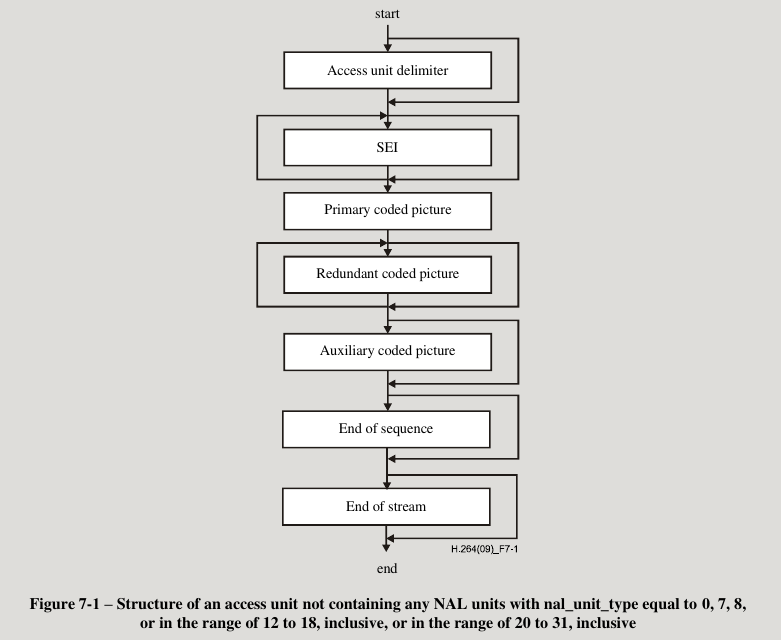

h264视频编码

参考资料：

- h264的mp4封装规范H.264-AVC-ISO_IEC_14496-15
- h264标准文档T-REC-H.264-202108-S!!PDF-E
- https://w3c.github.io/webcodecs/

本文档以webcodec为具体的例子来讲解视频编译器。

# 编码器输出的两种格式

在配置编译器时，可以配置编译码器输出为两种格式，一种是annexB格式，另一种的是AVC格式。h264标准中规定是annexB，就是Annex B Byte stream format。AVC格式定义在h264的mp4封装规范。AVC格式主要用于mp4封装和rtmp传输。对rtmp协议深入分析就会发现，rtmp传输的都是文件存储格式的流和mp4中的流能对应上。

参考文档：

https://w3c.github.io/webcodecs/#dictdef-videoencoderconfig

https://w3c.github.io/webcodecs/codec_registry.html

https://www.w3.org/TR/webcodecs-avc-codec-registration/#avc-bitstream-format

```
enum AvcBitstreamFormat {
  "annexb",
  "avc",
};
```


## 实例

```c++
    const config = {
        codec: "avc1.4d002a",
        width: trackSettings.width,
        height: trackSettings.height,
        framerate: 20,
        bitrate: 200000,
        avc: {
            format: "annexb",
        },
    };
```

这个表示把编码器配置成annexb格式。webcodec中h265默认输出为avc.


## avc格式

https://www.w3.org/TR/webcodecs-avc-codec-registration/#videodecoderconfig-description

完整的数据是编解码参数信息＋其它编码数据。

如果为avc格式，则编解码参数信息以带外参数返回。带外参数是指和原始编码流不是使用同一个接口。这个参数的格式为AVCDecoderConfigurationRecord。webcodec中就是以VideoDecoderConfig.description返回。而如果是ffmpeg则是对应AVCodecParameters字段extradata内容。

avc格式从编码器输出的编码流格式为

```
|length|nalu|length|nalu|...
```

length占用多少字节在AVCDecoderConfigurationRecord中的lengthSizeMinusOne中规定。如果lengthSizeMinusOne=3则length占用4字节。

nalu是annexb形式去掉0000001后的东西，它还是转义后的内容。如果去解析nalu则需要去掉这层转义。

## annexb格式

7.4.1 NAL unit semantics

完成的数据就是0000001的流，所有数据都是在同一个流上，如果把它保存下来，后缀为h264，则可以播放它了。

annexb格式，是以00000001或000001分隔的nalu流。

### nal转义

转义字节是0x03

```
0x000000 -> 0x00000300
0x000001 -> 0x00000301
0x000002 -> 0x00000302
0x000003 -> 0x00000303

```

如果遇到0x000003就把它变成0x0000,就是把转义字节是0x03丢掉即可。

# 解码接入单元组 access units

每个接入单元（AU）组都对应着一样视频帧。一组接入单元的格式下图。注意rtmp转递的每一个视频message都必须是一个AU，就是必须是一人视频帧数据，非视频数据不能单独作为一个message发送。



每个AUD表示一个接入单元组的开始。也就是说每一个AUD都会对应有一个视频帧的编码数据。

## nalu类型

Table 7-1 – NAL unit type codes, syntax element categories, and NAL unit type classes

nalu分为VCL和non-VCL。VCL对应一应视频帧数据，non-VCL对应非视频帧数据。在每次传输都需要一个视频帧的协议，比如rtmp,那么非视频数据要附在视频帧数据上。这样就产生了接入单元（AU）组的概念。
