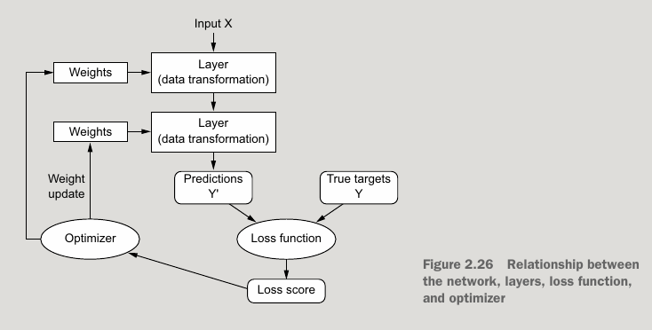
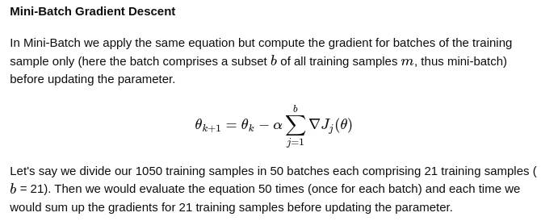
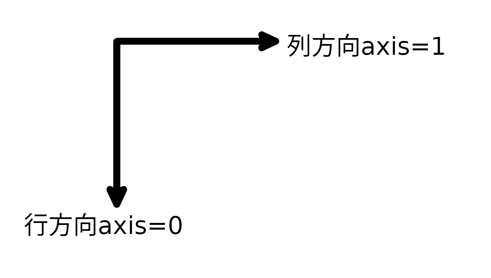

# 杂项

数学矩阵库eigen3，机器学习库tflite

skia, godot

always choose a smaller batch_size if you are training on laptops or mid-range GPUs.

leverage充分利用

This is because a deep learning model is just a chain of simple, continuous geometric
transformations mapping one vector space into another.

 deep nets generalize via interpolation on a manifold .

That’s the nature of intelligence: it is the ability to efficiently leverage the informa-
tion at your disposal in order to produce successful behavior in the face of an uncer-
tain, ever-changing future. 

A `Sequential` model is appropriate for **a plain stack of layers** where each layer has **exactly one input tensor and one output tensor**.

RMSProp (Root Mean Square Propagation) is an adaptive learning rate optimization algorithm

Sparse Categorical Crossentropy is a loss function  commonly used in multi-class classification problems in machine learning and deep learning and is particularly used when dealing with a large  number of categories. It is very similar to [Categorical Crossentropy](https://www.geeksforgeeks.org/deep-learning/categorical-cross-entropy-in-multi-class-classification/) but with one important difference i.e the true class labels are  provided as integers (category indices), not as one-hot encoded vectors.

This metric is used to measure how often the predictions made by the  model are same as the true labels. If the y_pred is the predicted label  and y_true is the true label of the instance, the Accuracy class  measures the number of times y_pred = y_true.

The *numpy.argmax* function returns the indices of the maximum values along a specified  axis in an array. This is useful for finding the position of the largest element in an array.

https://www.w3resource.com/python-exercises/numpy/basic/numpy-basic-exercise-34.php

```
We allow the addition of matrix and a vector, yielding another matrix
C=A+b
where C_i,j=A_i,j+b_j. In other words, the vector b is added to each row of the matrix. This shorthand eliminates the need to define a matrix with b copied into each row before doing the addition. This implicit copying of b to many locations is called broadcasting.
```

在设计np.array尽量保持同一行是一个样本，包括label, 所以在创建label数组是，是n行1列的。即np.zeros((num_samples_per_class, 1), dtype="float32")

variational autoencoders (VAEs)变分编码器 and generative adversarial networks(GANs)生成对抗网络. 

## keras本地数据集缓存路径

```
~/.keras/datasets
```


# 基本网络

DenseNet(A densely connected network )稠密连接网络

CONVNET(Convolution layer)

RNN(Recurrent neural network)循环神经网络

TRANSFORMERS变换器网络

# 搭建环境

https://www.tensorflow.org/install/pip#linux

配置GPU环境

sudo pip install tensorflow[and-cuda]

# 资料

https://www.montana.edu/rotella/documents/502/Prob_odds_log-odds.pdf

https://en.wikipedia.org/wiki/Logit

https://en.wikipedia.org/wiki/Logistic_function

https://en.wikipedia.org/wiki/Softmax_function

```
odds=p/(1-p) 事件发生概率比不发生的概率
logit(p)=ln(odds)=ln(p/(1-p))
sigmoid(x)=f(x)=exp(x)/(1+exp(x))
如果对logit作sigmoid变量，则f(logit(p))=exp(ln(odds))/(1+exp(ln(odds)))=p就是事件发生概率
softmax(X)_i=exp(x_i)/SUM_j(exp(x_j)),softmax是sigmoid向多维的扩展
```

```
Rectified Linear Unit, ReLU 斜坡函数
f(x) = max(0, x)
```

https://www.datacamp.com/tutorial/the-cross-entropy-loss-function-in-machine-learning

```
entropy, H(x), the greater the uncertainty for the probability distribution, and the smaller the value, the less uncertainty.
```

https://wandb.ai/sauravmaheshkar/cross-entropy/reports/What-Is-Cross-Entropy-Loss-A-Tutorial-With-Code--VmlldzoxMDA5NTMx

crossentropy:   -log(p), 如果p越小（不确定，那么出错可能性大，误差大），-log(p)则越大。所以按crossentropy=sum(y_c * -log(p_c))=y_true * -log(p_true)

# 整体结构

训练数据集,测试数据集,验证数据集。

深度学习与其它机器学习方式相比，优势在于深度学习不用提取特征值。但深度学习需要更大的运算量。

过度深度学习指过多提取了训练数据集里的模式，这些模式在测试数据集里的不存在的，导致在测试集中准确性下降。



# 编码

如果grams为2，表示单词和双词在生成字典时作为不同的编码对象。

## one hot

0001 0010 0100 1000表示4类

## binary

有序

00 01 10 11表示4类

ascii码就是binary编码.

举例：

```
i am boy
i am little girl
```

生成字典：

```
i -> 1
am -> 2
boy -> 3
little -> 4
girl -> 5
```

生成出来的序列就是：

```
i am boy -> [1 2 3]
i am little girl -> [1 2 4 5]
```

在机器学习中要有统一向量长度，这里设置为6那就成了

```
[1 2 3 0 0]
[1 2 4 5 0]
```


## multi hot

无序

是one hot的合并，比如0011表示同时有第一类0001和第二类0010

举例：

```
i am boy
i am little girl
```

在机器学习中要有统一向量长度，这里设置为6.

```
i ->       1,0,0,0,0,0
am ->      0,1,0,0,0,0
boy ->     0,0,1,0,0,0
little->   0,0,0,1,0,0
girl ->    0,0,0,0,1,0
```

生成出来的序列就是 

```
[1 1 1 0 0 0]
[1 1 0 1 1 0]
```


# keras

shape就是下标的索引信息。

```
(train_images, train_labels), (test_images, test_labels) = mnist.load_data()
train_images = train_images.reshape((60000, 28 * 28))
train_images = train_images.astype("float32") / 255
test_images = test_images.reshape((10000, 28 * 28))
test_images = test_images.astype("float32") / 255

model = keras.Sequential([
layers.Dense(512, activation="relu"),
layers.Dense(10, activation="softmax")
])
```

y=relu(wx+b) 第一层为512维。这里一个维（层里的一个节点）表示一个张量操作。

y=softmax(wx+b) 第二层为10维。

一个样本为28x28=784个属性（维度），共有60000个训练样本。一个样子经过模型后，会变为属性为10（维度），每个维度表示这个样本分类的可能性。

XW＝Y这里X是X是(60000, 784), W是(784, 10),Y是(60000, 10).

```
model.compile(optimizer="rmsprop",
loss="sparse_categorical_crossentropy",
metrics=["accuracy"])
```

softmax输入如果为一个向量则输出也是一个向量，不过它会规一化为所以维度和为1.比如：一个样本的输出为(1, 1) 会softmax变成(0.5, 0.5).  如果这个样本的分类为(0, 1)表示为第二类，那么这个样本的损失函数值(假设为abs)就是abs((0.5, 0.5), (0, 1))=|0.5 - 0| + |0.5 - 1|=1, 损失值(loss score)为1.损失函数值始终是一个标量。每个样本都会计算去让梯度下降的向量detaJ,但我不一定就会去更新参数。

optimizer能同时更新所有层的参数，因为梯度在某点的值与当前输入无关，而在在反向传播时，所有的值都是确定的。所以能同时更新所有层的参数。

```
model.fit(train_images, train_labels, epochs=5, batch_size=128)
```

batch_size表示处理128个样本后，更新一次参数。更新参数和计算梯度变化是两个过程，我计算了梯度变化也不一定就立即却更新参数。多个梯度变化求和后才去更新梯度。这个“多个”量就是batch_size.

epochs表示对所有有的输入样本，每个样本都输入5次。所有样本处理一次表示一次迭代。



## shape

shape=()表示标量

shape=(2,)表示向量，2维

shape=(2,3)表示矩阵，2行3列，2x3=6即6维。

## 维度

样本可以用一个数组表示，样本的维度等于数组各级索引的乘积，比如，一个样本

```
picture[width][height]的维度是width*height
layers.Dense(96, activation="relu")
```

为避免冲突，尽量用数组第一级索引，第二级索引这样去描述。

layers.Dense中第一个参数对应是输出维度，在上面的例子中，肯定是有width*height大于96的，也就是说，整体维度是下降的。如果使用了卷积，维度会上升，因为提取了特性。

一个样本的每一个维度对应这个样本的属性。一个彩色相素有5个维度，(x, y, r, g, b),如果这个相素是时间相关的，那就是6维了(t, x, y, r, g, b).

```
input_dim = 2
output_dim = 1
W = tf.Variable(initial_value=tf.random.uniform(shape=(input_dim, output_dim)))
b = tf.Variable(initial_value=tf.zeros(shape=(output_dim,)))
```

这里input_dim，output_dim描述的是一个layer的参数，而不是单一layer中某个变换结点的参数。

```
def model(inputs):
    return tf.matmul(inputs, W) + b
```

input是2维，num个样本。

W输入是2维，输出是1维

B输入输出都是1维。

tf.random.uniform((2, 2)这里表示生成一个2x2的数组，数据中每个元素都是均匀分布。


## 梯度(gradient),导数（derivative）

一个函数在某一点x0处的导数与当前输入是否为x0无关。导数是函数固有属性，与输入无关，即使当前输入为x2了，在x0处的导数还是同样的值。

导数是斜率，一个标量。指在一个方向上单位x变化时，y的变化值。

复合函数和导数等于各组合函数的导数相乘（链式法则），注意，导数是标量。导数链式法则就是标量相乘。

在tf里，在某点处的梯度是自动计算的，自动差分。再依据链式法则，将这些连接起来。

```
input_var = tf.Variable(initial_value=3.)
with tf.GradientTape() as tape:
   result = tf.square(input_var)
gradient = tape.gradient(result, input_var)
```

这里在with语句范围内，表示开启自动差分功能记录伴随梯度。

tape.gradient(result, input_var)这里就是使用梯度了。

## 层layer

layer输入张量，输出也是张量，layer是对张量的变换。layer的状态就是knowledge,这个系统学习到的知识。比如weight和b这些参数。

每层的输入是一个张量数组，第一维信息始终是张量的个数。

## keras.layers.Conv2D

第一个参数是filters可能理解为提取的特征数

第三个参数是kernel_size核的窗口大小

举例

```
layers.Conv2D(64, 3, activation="relu", padding="same")
```

如果没有padding那么，如果原来是(x, y)输出的shape就是(x-2, y-2)因为在3x3的卷积核在四边位置是无法进行的，上下左右各减1.加上padding="same"就解决这个问题了。

```
layers.Conv2D(64, 3, strides=2, activation="relu", padding="same")
```

strides=2指卷积核以2为步长进行迭代，就会导致shape由(x,y)变成(x/2, y/2)

## layers.MaxPooling2D

```
layers.MaxPooling2D(pool_size=2)
```

表示从2x2的像素窗口中挑取最大值，pool_size=2会导致shape由(x,y)变成(x/2, y/2)


## tf.ones

```
tf.ones([3, 4], tf.int32)
```

表示是3行4列，3个向量，向量维数为4.这是一个矩阵。

```
x = tf.ones(shape=(3))
```

这是一个维度为3的向量。这是一个向量，不是矩阵。

tf.ones(shape=(2, 3)) 由2个tf.ones(shape=(3))组合而成。依此递归。tf.ones(shap=(2,3,4))由两个tf.ones(shap=(3,4))组成。

```
tf.Tensor(6.0, shape=(), dtype=float32)
```

shape为空，表示这是一个标量6.

## Sequential

序列模型适合单个输入张量单输出张量层的级联。

## numpy.mean(axis=)

axis可以理解为对指定维度进行平均。比如axis=0表示沿第一索引进行平均，平均后，第一索引就不存在了。axis=1表示沿着第二索引进行平均，平均后，第二索引就不存在了。

## model.evaluate

返回的参数对应model.compile()中loss，metrics参数。

## numpy中的axis



## weight regularization

Large weights in a neural network are a sign of a more complex network that has overfit the training data.

Generally, we refer to this model as having a large variance and a small bias.

## 多输入多输出模型

https://keras.io/guides/training_with_built_in_methods/#passing-data-to-multiinput-multioutput-models

如果模型有多个输出，则可以对应有不同的loss函数，如果没有或值为None表示，这个对应的输出不会去更新模型参数。当多个输出定义了loss函数，由这多个输出去更新参数时，可以通过loss_weights来控制每个输出对更新模型参数产生的效果。

## layer output

```
features = model.layers[4].output
difficulty = layers.Dense(3, activation="softmax", name="difficulty")(features)
```

每一层的输出，可以作为下一层的输入。

## keras.metrics.SparseCategoricalAccuracy

```
acc = np.dot(sample_weight, np.equal(y_true, np.argmax(y_pred, axis=1))
```

np.argmax表示取最大值的下标。`sparse categorical accuracy`: an idempotent operation that simply divides `total` by `count`.

## tf.keras.losses.sparse_categorical_crossentropy                                    

```
y_true = [1, 2]
y_pred = [[0.05, 0.95, 0], [0.1, 0.8, 0.1]]
loss = keras.losses.sparse_categorical_crossentropy(y_true, y_pred)
assert loss.shape == (2,)
loss

```

y_true是下标，y_true中的1表示y_pred中在[0.05, 0.95, 0]，0.95应该是最大的，实际是也是最大的，所有这个预测值是对的。按这种思路去分析第二个样本，第二个样本的预测值就是错的，有偏差。有个预值值都 会对应有个损失值。

带sparse和不带的区域在于，不带sparse使用的one-hot编码，带的是使用整数下标。


# python的with语句

python对象中的

```
__enter__ / __exit__
```

在with语句中自动调用。相比init/del更有确定性。

# 基本流程

## 准备样本

把样本调整为统一维度的张量。

一批样本输入给model的shape应该是(样本数，第一索引，第二索引，..., 第N索引，channel数)

如果一张图片作为model输入，则是(1, 图片的宽，图片的高，3)， 1表示1张图片，3表示RGB三通道。

样本维数始终是

```
第一索引 * 第二索引 * ... * 第N索引 * channel数
```

channel数也是索引，那就是

```
第一索引 * 第二索引 * ... * 第N索引
```


### tf.data.Dataset

输入给模型的数据必须是DataSet类，如果不是则需要转换成tf.data.Dataset类。在DataSet中有batch_size参数，表示在一次读操作中读到的样本数。

### tf.TensorShape

```
t = tf.constant([[1,2,3],[4,5,6]])
t.shape
TensorShape([2,3])
```

表示有2个维度，第一维度下标范围是[0, 2), 第二维度下标范围是[0, 3)

每个维度都是有它的取值范围。

### tf.keras.layers.Flatten

```
x = keras.Input(shape=(10, 64))
y = keras.layers.Flatten()(x)
y.shape
(None, 640)
```

keras.Input shape不包括batch_size, 如果为None表示是变长的，比如序列sequence length

```
inputs = keras.Input(shape=(None,), dtype="int64")
```

shape描述的是下标索引，dtype表示是在这个索引下的值。在下标确认的情况下，值只有一个，类型也只能是一个。

## 定义模型

model = keras.Sequential()

## 编译模型

model.compile()

## 训练模型

model.fit()

## 验证模型误差

model.evaluate(x_test, y_test)

## 使用模型产生预测值

model.predict()

# 机器学习基础

中间层越多，更会出现过度学习。over-fitting.

Deep learning is curve fitting, not magic.

deep learning models can only make sense of inputs that are very close to what they’ve seen during training.

neural networks don’t like very large input values, or discrete input distributions.

# 卷积神经网络

训练卷积网络的一般过程是特征图的深度变大，而特征图大小变小。降维到一维。

# 在TensorFlow运行kera模型

参考仓库github.com:otp7611/from-keras-to-c.git

tf版本2.18.0，这个tf版本只能使用cuda12的库。cuda_12.4.0_550.54.14_linux.run

tf需要cudnn，这个与cuda是不同的东西，需要独立下载。或使用python中的库。

python使用kera, tf与tf要一致TensorFlow version: 2.18.0。

tf c api中要输入输出节点的名字，可以通过get_name.py来拿到。

PATH一定要配置，用于找ptxas.如果使用cuda12就要使用cuda12的ptxas.

```
export PATH=/media/workspace/cuda1204/instdir/bin:$PATH
export LD_LIBRARY_PATH=/media/workspace/cuda1204/instdir/lib64:/usr/local/lib/python3.10/dist-packages/nvidia/cudnn/lib/
```

# tensorflow-2.18.1编译方法

所有cuda配置依赖文件都是在third_party/xla/third_party/tsl.其它目录也有类似文件,但不是.@local_tsl就是指向third_party/xla/third_party/tsl.

third_party/xla/third_party/tsl/third_party/gpus/cuda/hermetic/cuda_configure.bzl

third_party/xla/third_party/tsl/third_party/gpus/cuda/hermetic/cuda_redist_init_repositories.bzl

尽量使用网址测试通过的最新分支，因为旧分支的依赖库可能已经被删除了。

local_config_cuda通过cuda_cudart使用cuda配置.如果出现cuda错误,而很可能是cuda_cudart配置错误.

## 准备环境

### 工具依赖

```
sudo apt install patchelf gcc-12 g++-12
```


### tfinit.sh

```
export PATH=/media/workspace/clang17/instdir/bin/:/media/workspace/cuda1204/instdir/bin:$PATH
export LD_LIBRARY_PATH=/media/workspace/clang17/instdir/lib/x86_64-unknown-linux-gnu:/media/workspace/cuda1204/instdir/lib64:/media/workspace/cudnn0910/instdir/lib/
```

这样在configure能自动识别clang-17

出现undefined symbol: _ZNSt3__122__libcpp_verbose_abortEPKcz表示C++库没有正确找到。

这里检测的出clang比如clang-17,在不加参数的情况下，一下要能够编译cpp代码，比如：

clang-17 test.cpp

```
#include <memory>

int main() {return 0;}
```

如果失败，请确定默认头文件依赖。

```
clang-17 -E -xc++ - -v
```

如果你使用的clang是clang+llvm-17.0.6-x86_64-linux-gnu-ubuntu-22.04.tar.xz

则一定要安装包gcc-12 g++-12. 他是依赖g++-12的。


### 配置从官网下载nvidia相关库

不是从storage.googleapis.com下载.这样加快速度.

third_party/xla/third_party/tsl/third_party/repo.bzl

```
def tf_mirror_urls(url):
    """A helper for generating TF-mirror versions of URLs.

    Given a URL, it returns a list of the TF-mirror cache version of that URL
    and the original URL, suitable for use in `urls` field of `tf_http_archive`.
    """
    nvidia = "https://developer.download.nvidia.com"
    print(url)
    if url.startswith(nvidia):
        return [url]
    if not url.startswith("https://"):
        return [url]
    return [
        "https://storage.googleapis.com/mirror.tensorflow.org/%s" % url[8:],
        url,
    ]
```

### 配置tf内部python3安装软件包时使用国内源

OutputUserRoot/458e09755a092c4c605421b63672f1ff/external/rules_python/python/private/pypi/whl_installer/wheel_installer.py

```
    pip_args = (
        [sys.executable, "-m", "pip"]
        + (["--isolated"] if args.isolated else [])
        + (["download", "--only-binary=:all:"] if args.download_only else ["wheel"])
        + [ "-i", "https://pypi.mirrors.ustc.edu.cn/simple/" ]
        + ["--no-deps"]
        + deserialized_args["extra_pip_args"]
    )

```

### 修复cuda_cudart中对cuda1204的配置错误

cuda1204安装目录现在是没有lib目录的,只有lib64. 我们需要把lib指向lib64.

cuda1204的extras并不是放在include里的,需要在cuda_cudart配置,并在local_config_cuda引用它.

## 运行configure

confiure完成后会产生.tf_configure.bazelrc

cuda,cudnn配置正确的版本号和路径. 

cuda    /media/workspace/cuda1204/instdir   12.4.0

cudnn   /media/workspace/cudnn0910/instdir   9.10.2

注意版本号一定是x.y.z这种格式.

配置cuda支持的架构.sm_80.

注意一定是sm_xy这种格式.sm_35已经不支持了.

使用clang昨为编译器,注意一定要使用官网建议的版本.否指会出现编译选项错误.

在PATH正确的情况下,clang是能够正确识别的.

### CAPABILITIES

默认情况下,CAPABILITIES是包括sm_35.但是sm_35已经不支持了.

```
./configure.py:33:_DEFAULT_CUDA_COMPUTE_CAPABILITIES = '3.5,7.0'
build:cuda --repo_env HERMETIC_CUDA_COMPUTE_CAPABILITIES="sm_70"
```

https://developer.nvidia.com/cuda-gpus  注意GeForce RTX 3050要选为sm_80

## 编译

```
bazel --output_user_root=${basepath}/OutputUserRoot build --local_cpu_resources=16 --verbose_failures //tensorflow:libtensorflow_framework.so //tensorflow:libtensorflow.so //tensorflow/tools/pip_package:wheel --repo_env=USE_PYWRAP_RULES=1 --repo_env=WHEEL_NAME=tensorflow --config=cuda_wheel
```

编译完成后会输出bazel-bin/tensorflow/tools/pip_package/wheel_house/tensorflow-2.18.1-cp310-cp310-linux_x86_64.whl

## 安装

```
pip install -i https://pypi.mirrors.ustc.edu.cn/simple/  bazel-bin/tensorflow/tools/pip_package/wheel_house/tensorflow-2.18.1-cp310-cp310-linux_x86_64.whl
```

## 测试

```
LD_LIBRARY_PATH=/media/workspace/clang17/instdir/lib/x86_64-unknown-linux-gnu:/media/workspace/cuda1204/instdir/lib64:/media/workspace/cudnn0910/instdir/lib/  XLA_FLAGS=--xla_gpu_cuda_data_dir=/media/workspace/github/tensorflow/OutputUserRoot//458e09755a092c4c605421b63672f1ff/external/cuda_nvcc TF_ENABLE_ONEDNN_OPTS=0 python3 ../train_and_export.py
```

```
LD_LIBRARY_PATH=/media/workspace/clang17/instdir/lib/x86_64-unknown-linux-gnu:/media/workspace/cuda1204/instdir/lib64:/media/workspace/cudnn0910/instdir/lib/  XLA_FLAGS=--xla_gpu_cuda_data_dir=/media/workspace/github/tensorflow/OutputUserRoot//458e09755a092c4c605421b63672f1ff/external/cuda_nvcc TF_ENABLE_ONEDNN_OPTS=0 ../builddir/model_run
```


